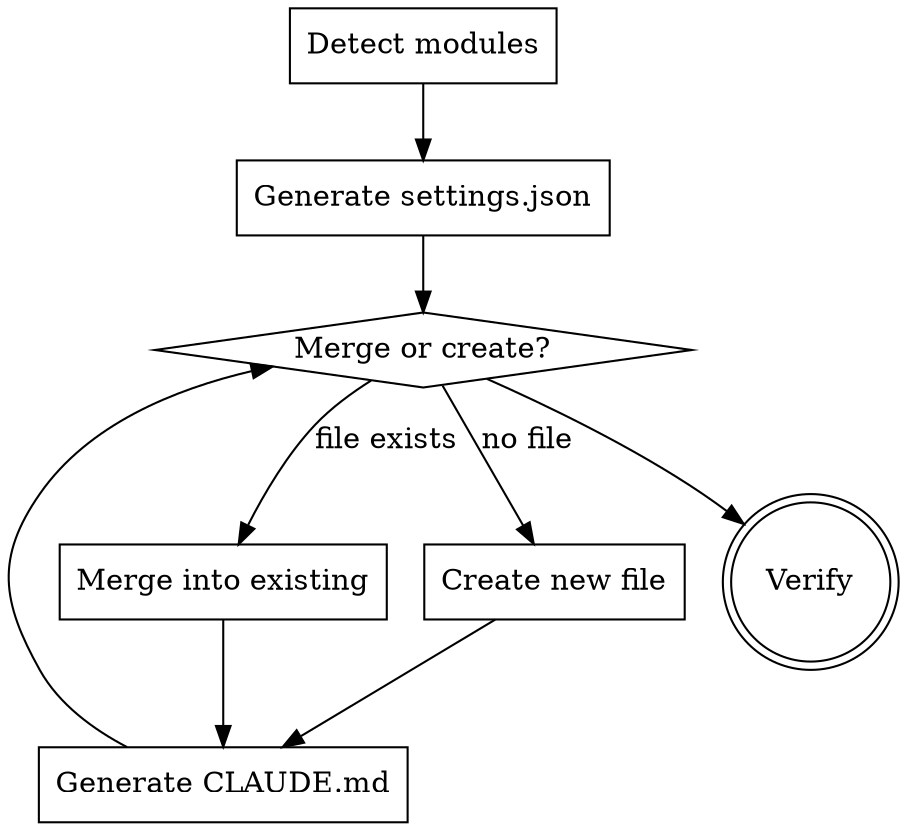

# MoonBit Project Settings Bootstrap

Set up `.claude/settings.json` and `CLAUDE.md` for a MoonBit project. Auto-detects project structure. Idempotent — safe to re-run.

## Process



## Step 1: Auto-Detect Project Structure

Scan from working directory:

```bash
# Find all MoonBit modules
find . -name "moon.mod.json" -not -path "./.worktrees/*"

# Find all packages per module
find . -name "moon.pkg.json" -not -path "./.worktrees/*"

# Detect test files
find . -name "*_test.mbt" -o -name "*_wbtest.mbt" -o -name "*_benchmark.mbt" | head -20

# Check for git submodules
cat .gitmodules 2>/dev/null
```

Record: module names, package paths, test file locations, submodule presence.

## Step 2: Generate `.claude/settings.json`

### Correct Hook Schema

Claude Code hooks use this EXACT format — do NOT use `"PreCommit"` or other made-up keys:

```json
{
  "hooks": {
    "PreToolUse": [
      {
        "matcher": "Bash(git commit*)",
        "hooks": [
          {
            "type": "command",
            "command": "moon check && moon test",
            "timeout": 120
          }
        ]
      }
    ],
    "PostToolUse": [
      {
        "matcher": "Edit|MultiEdit",
        "hooks": [
          {
            "type": "command",
            "command": "moon check 2>&1 | head -20"
          }
        ]
      }
    ],
    "SessionStart": [
      {
        "hooks": [
          {
            "type": "command",
            "command": "moon update",
            "timeout": 30
          }
        ]
      }
    ]
  }
}
```

### Key rules

- **`PreToolUse` with `matcher`** — NOT `"PreCommit"`. The matcher `"Bash(git commit*)"` scopes the hook to commit commands only.
- **`PostToolUse` on `Edit|MultiEdit`** — runs `moon check` after every file edit, surfacing errors immediately rather than letting them compound across multiple files.
- **Keep pre-commit fast** — only `moon check && moon test` for the current module. Do NOT run `moon info && moon fmt` in the hook (those change files, which is confusing mid-commit). Do NOT run all modules — just the current one.
- **Relative commands** — do NOT hardcode absolute paths. The hook runs from the working directory.
- **`SessionStart`** — run `moon update` to ensure dependencies are fresh.

### Idempotent Merge

If `.claude/settings.json` already exists:

1. Read the existing file
2. Parse as JSON
3. For each hook key (`PreToolUse`, `PostToolUse`, `SessionStart`):
   - If the key doesn't exist → add it
   - If the key exists → check if a matching entry already exists (same matcher/command). Skip if duplicate; append if new.
4. Preserve all other existing keys (e.g., `permissions`, `enabledPlugins`)
5. Write the merged result

**NEVER overwrite the entire file.**

### Multi-Module Projects

For monorepos with multiple `moon.mod.json` files, the pre-commit hook should run checks for each module:

```json
{
  "hooks": {
    "PreToolUse": [
      {
        "matcher": "Bash(git commit*)",
        "hooks": [
          {
            "type": "command",
            "command": "cd loom && moon check && moon test && cd ../seam && moon check && moon test && cd ../incr && moon check && moon test && cd ../examples/lambda && moon check && moon test",
            "timeout": 300
          }
        ]
      }
    ]
  }
}
```

Adjust module paths based on auto-detected structure. Use relative paths from the project root.

## Step 3: Generate `CLAUDE.md`

### Keep CLAUDE.md Short — Use @-imports for Shared Content

CLAUDE.md is loaded into every request. Embedding fixed MoonBit conventions inline means every project pays ~100 token overhead for content that never changes. Instead:

1. **Write shared MoonBit conventions once** to `~/.claude/moonbit-base.md` (user-level, reused across all MoonBit projects)
2. **CLAUDE.md @-imports it** — one line instead of 100
3. **CLAUDE.md only contains project-specific facts** — module structure, submodules, docs paths, key facts

**Target size:** CLAUDE.md should be under 80 lines. If it's longer, extract the generic parts.

### Section Order (MANDATORY)

Generate sections in this EXACT order. The file should be lean — project-specific content only, shared conventions @-imported.

1. `# Project title` — one-line description
2. `@~/.claude/moonbit-base.md` — imports all shared MoonBit conventions (Language Notes, Code Search, Conventions, Code Changes, Code Review Standards, Development Workflow, Git & PR Workflow)
3. `## Project Structure` — auto-detected submodules + packages, with archive path convention
4. `## Commands` — auto-detected per-module commands
5. `## Documentation` — auto-detected from docs/ structure, with archive rule
6. `## Key Facts` — project-specific facts (CRDT algorithm, language, ground truth, etc.)

### Generate `~/.claude/moonbit-base.md` (if not exists)

Write the shared base file once. Skip if already exists.

```markdown
# MoonBit Base Conventions

## MoonBit Language Notes

- `pub` vs `pub(all)` visibility modifiers have different semantics — check current docs before using
- `._` syntax is deprecated, use `.0` for tuple access
- `try?` does not catch `abort` — use explicit error handling
- `?` operator is not always supported — use explicit match/error handling when it fails
- `ref` is a reserved keyword — do not use as variable/field names
- Blackbox tests cannot construct internal structs — use whitebox tests or expose constructors
- For cross-target builds, use per-file conditional compilation rather than `supported-targets` in moon.pkg.json
- Error handling syntax: use `Unit!Error` or `T!Error` for fallible return types. Error propagation uses `!` suffix on calls, not `raise` keyword. Always verify MoonBit syntax against recent compiler behavior before committing.

## MoonBit Code Search

Prefer `moon ide` over grep/glob for MoonBit-specific code search. These commands use the compiler's semantic understanding, not text matching.

```bash
moon ide peek-def SyncEditor              # Go-to-definition with context
moon ide peek-def -loc editor/foo.mbt:5   # Definition at cursor position
moon ide find-references SyncEditor       # All usages across codebase
moon ide outline editor/                  # Package structure overview
moon ide doc "String::*rev*"              # API discovery with wildcards
```

Symbol syntax: `Symbol`, `@pkg.Symbol`, `Type::method`, `@pkg.Type::method`

When to use: finding definitions, tracing usages, understanding package APIs, discovering methods. Falls back to grep only for non-MoonBit files or cross-language patterns.

## MoonBit Conventions

- **Block-style:** Code organized in `///|` separated blocks
- **Testing:** Use `inspect` for snapshots, `@qc` for properties
- **Files:** `*_test.mbt` (blackbox), `*_wbtest.mbt` (whitebox), `*_benchmark.mbt`
- **Format:** Always `moon info && moon fmt` before committing
- **Trait impl:** `pub impl Trait for Type with method(self) { ... }` — one method per impl block
- **Arrow functions:** `() => expr`, `() => { stmts }`. Empty body: `() => ()` not `() => {}`

## Code Changes

- Before suggesting code removal, check if symbols are re-exported as public API for downstream consumers. Do not delete structs/types that appear unused internally but may be part of the library's public interface.

## Code Review Standards

- Never dismiss a review request — always do a thorough line-by-line review even if changes seem minor
- Check for: integer overflow, zero/negative inputs, boundary validation, generation wrap-around
- Do not suggest deleting public API types (Id structs, etc.) as 'unused' — they may be needed by downstream consumers
- Verify method names match actual API before writing tests (e.g., check if it's `insert` vs `add_local_op`)

## Development Workflow

### Performance Optimization Rule

Before designing any performance optimization, write a microbenchmark that **reproduces the claimed bottleneck** in isolation. If the benchmark can't demonstrate the problem, stop and re-evaluate. Stale profiling data and O(bad) complexity are not proof of a real problem.

### Incremental Edit Rule

**CRITICAL:** After every file edit, run `moon check` before proceeding to the next file. If there are errors, fix them immediately before continuing with the plan.

### Standard Workflow

1. Make edits
2. `moon check` — Lint
3. `moon test` — Run tests
4. `moon test --update` — Update snapshots (if behavior changed)
5. `moon info` — Update `.mbti` interfaces
6. Check `git diff *.mbti` — Verify API changes
7. `moon fmt` — Format

## Git & PR Workflow

- Always check if git is initialized before running git commands
- After rebase operations, verify files are in the correct directories
- When asked to 'commit remaining files', interpret generously even if phrasing is unclear
- When merging PRs, always verify CI status is actually passing (not skipped) before proceeding. Never represent CI as green if any checks were skipped or failed.
- After rebasing or refactoring, verify file paths haven't shifted unexpectedly. Run `git diff --stat` to confirm only intended files changed.
```

### Auto-Detected Section: Commands

Generate per-module commands based on discovered `moon.mod.json` files:

```markdown
## Commands

```bash
cd <module1> && moon check && moon test    # N tests
cd <module2> && moon check && moon test    # N tests
```

Before every commit:
```bash
moon info && moon fmt   # regenerate .mbti interfaces + format
```

Benchmarks (always `--release`):
```bash
cd <module_with_benchmarks> && moon bench --release
```
```

### Auto-Detected Section: Package Map

Build a table per module from discovered `moon.pkg.json` files. Include package path and purpose (inferred from directory name and imports).

### Auto-Detected Section: Documentation

If a `docs/` directory exists, generate a Documentation section listing the subdirectories. Include the documentation doctrine rules and the archive rule:

```markdown
## Documentation

**Main docs:** [docs/](docs/)

- **Architecture:** [docs/architecture/](docs/architecture/) — principles and invariants only
- **Development:** [docs/development/](docs/development/)
- **Performance:** [docs/performance/](docs/performance/) — dated snapshots, not updated in place
- **Archive:** `docs/archive/` — completed plans and stale documents. Do not search here unless you need historical context.

**Documentation rules:**
- Architecture docs = principles only, never reference specific types/fields/lines. Link to files instead.
- Plans = implementation details (struct defs, code examples, file paths). Archived on completion.
- Performance docs = dated snapshots. New measurements go in new files, old ones are not updated.
- Code is the source of truth — if a doc and the code disagree, the doc is wrong.
```

The **documentation doctrine is mandatory** for all generated CLAUDE.md files. It prevents the staleness problem where architecture docs reference specific types/fields that change every PR. The **archive rule is mandatory** when `docs/archive/` exists.

### Idempotent Merge for CLAUDE.md

If `CLAUDE.md` already exists:

1. Read existing content
2. Parse section headings (`## ...`)
3. For each required section:
   - If heading already exists → **skip** (do not overwrite user customizations)
   - If heading is missing → **append** at the correct position in the ordering
4. Never remove existing sections

## Step 4: Verify

After generating both files, run:

```bash
cat .claude/settings.json | python3 -m json.tool  # Verify valid JSON
head -50 CLAUDE.md  # Verify section order
moon check  # Verify project still works
```

## Common Mistakes

| Mistake | Fix |
|---------|-----|
| Using `"PreCommit"` hook key | Use `"PreToolUse"` with `"matcher": "Bash(git commit*)"` |
| Hardcoding absolute paths in hooks | Use relative paths from project root |
| Running `moon fmt` in pre-commit hook | `moon fmt` modifies files — don't run during commit check |
| Overwriting existing settings.json | Read first, merge, then write |
| Embedding fixed sections inline | Put shared conventions in `~/.claude/moonbit-base.md` and @-import |
| CLAUDE.md over 80 lines | Extract generic MoonBit rules to the base file |
| Running all modules in single-module project | Detect module count and scope accordingly |
| Archive path wrong | `docs/archive/` not `docs/plans/archive/` — always verify before moving |
