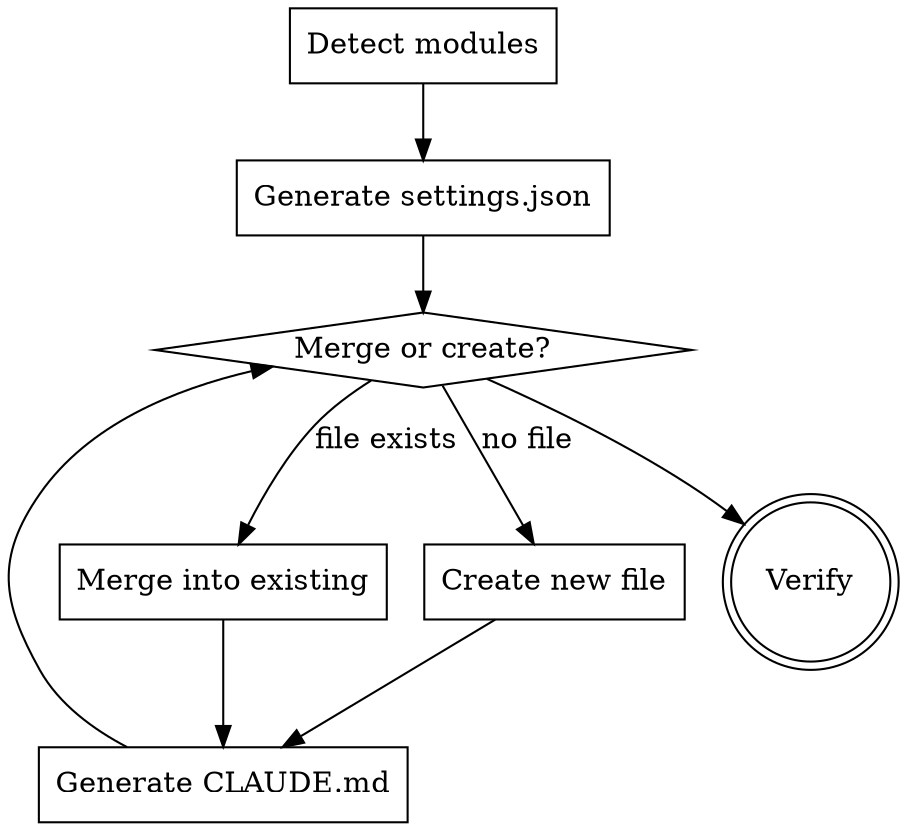

# MoonBit Project Settings Bootstrap

Set up `.claude/settings.json` and `CLAUDE.md` for a MoonBit project. Auto-detects project structure. Idempotent — safe to re-run.

## Process



## Step 1: Auto-Detect Project Structure

Scan from working directory:

```bash
# Find all MoonBit modules
find . -name "moon.mod.json" -not -path "./.worktrees/*"

# Find all packages per module
find . \( -name "moon.pkg.json" -o -name "moon.pkg" \) -not -path "./.worktrees/*" -not -path "./.mooncakes/*"

# Detect test files
find . \( -name "*_test.mbt" -o -name "*_wbtest.mbt" -o -name "*_benchmark.mbt" \) -not -path "./.mooncakes/*" | head -20

# Check for git submodules
cat .gitmodules 2>/dev/null
```

Record: module names, package paths, test file locations, submodule presence.

## Step 2: Generate `.claude/settings.json`

### Correct Hook Schema

Claude Code hooks use this EXACT format — do NOT use `"PreCommit"` or other made-up keys:

```json
{
  "hooks": {
    "PreToolUse": [
      {
        "matcher": "Bash(git commit*)",
        "hooks": [
          {
            "type": "command",
            "command": "moon check && moon test",
            "timeout": 120
          }
        ]
      },
      {
        "matcher": "Bash(git push*)",
        "hooks": [
          {
            "type": "command",
            "command": "git submodule foreach 'git diff --exit-code @{push}.. 2>/dev/null || echo WARNING: unpushed submodule commits in $name'",
            "timeout": 30,
            "statusMessage": "Checking for unpushed submodule commits..."
          }
        ]
      }
    ],
    "PostToolUse": [
      {
        "matcher": "Edit|MultiEdit",
        "hooks": [
          {
            "type": "command",
            "command": "moon check 2>&1 | head -20"
          }
        ]
      }
    ],
    "SessionStart": [
      {
        "hooks": [
          {
            "type": "command",
            "command": "moon update",
            "timeout": 30
          },
          {
            "type": "command",
            "command": "bash scripts/package-overview.sh",
            "timeout": 30,
            "statusMessage": "Discovering package structure..."
          }
        ]
      }
    ]
  }
}
```

### Key rules

- **`PreToolUse` with `matcher`** — NOT `"PreCommit"`. The matcher `"Bash(git commit*)"` scopes the hook to commit commands only.
- **`PreToolUse` for `git push`** — checks all submodules for unpushed commits before pushing. Prevents CI failures from missing submodule refs.
- **`PostToolUse` on `Edit|MultiEdit`** — runs `moon check` after every file edit, surfacing errors immediately rather than letting them compound across multiple files.
- **Keep pre-commit fast** — only `moon check && moon test` for the current module. Do NOT run `moon info && moon fmt` in the hook (those change files, which is confusing mid-commit). Do NOT run all modules — just the current one.
- **Relative commands** — do NOT hardcode absolute paths. The hook runs from the working directory.
- **`SessionStart`** — run `moon update` to ensure dependencies are fresh. Run `scripts/package-overview.sh` to provide a live package map (replaces static Package Map in CLAUDE.md).

### Hooks enforce behavior, CLAUDE.md states policy

**Principle:** If a behavior can be enforced mechanically by a hook, do NOT also state it as a rule in CLAUDE.md. Hooks are reliable; rules get ignored under pressure. CLAUDE.md should only contain:
- Policy that can't be automated (code review standards, architectural decisions)
- Context that can't be derived (MoonBit gotchas, design direction)
- Pointers to tools and commands (not the workflow itself)

### Idempotent Merge

If `.claude/settings.json` already exists:

1. Read the existing file
2. Parse as JSON
3. For each hook key (`PreToolUse`, `PostToolUse`, `SessionStart`):
   - If the key doesn't exist → add it
   - If the key exists → check if a matching entry already exists (same matcher/command). Skip if duplicate; append if new.
4. Preserve all other existing keys (e.g., `permissions`, `enabledPlugins`)
5. Write the merged result

**NEVER overwrite the entire file.**

### Multi-Module Projects

For monorepos with multiple `moon.mod.json` files, the pre-commit hook should run checks for each module:

```json
{
  "hooks": {
    "PreToolUse": [
      {
        "matcher": "Bash(git commit*)",
        "hooks": [
          {
            "type": "command",
            "command": "cd loom && moon check && moon test && cd ../seam && moon check && moon test && cd ../incr && moon check && moon test && cd ../examples/lambda && moon check && moon test",
            "timeout": 300
          }
        ]
      }
    ]
  }
}
```

Adjust module paths based on auto-detected structure. Use relative paths from the project root.

## Step 3: Generate `CLAUDE.md`

### Keep CLAUDE.md Short — Use @-imports for Shared Content

CLAUDE.md is loaded into every request. Embedding fixed MoonBit conventions inline means every project pays ~100 token overhead for content that never changes. Instead:

1. **Write shared MoonBit conventions once** to `~/.claude/moonbit-base.md` (user-level, reused across all MoonBit projects)
2. **CLAUDE.md @-imports it** — one line instead of 100
3. **CLAUDE.md only contains project-specific facts** — module structure, submodules, docs paths, key facts

**Target size:** CLAUDE.md should be under 80 lines. If it's longer, extract the generic parts.

### Section Order (MANDATORY)

Generate sections in this EXACT order. The file should be lean — project-specific content only, shared conventions @-imported. Do NOT include sections that are derivable from tooling or enforced by hooks.

1. `# Project title` — one-line description
2. `@~/.claude/moonbit-base.md` — imports all shared MoonBit conventions (Language Notes, Code Search, Conventions, Code Review Standards, Git & PR Workflow)
3. `## MoonBit Language Notes` — project-specific gotchas only (not generic MoonBit rules — those go in base)
4. `## Commands` — auto-detected per-module commands
5. `## Documentation` — condensed: key rules only, NOT a file listing (use `ls docs/` instead)
6. `## Development Workflow` — CRITICAL rules only (UI prototype-first, perf benchmark-first). Do NOT repeat what hooks enforce.
7. `## MoonBit Conventions` — project-specific patterns with code examples in a separate reference file
8. `## Design Context` — if the project has UI/visual components

**Removed sections (compared to earlier versions):**
- ~~Package Map~~ — replaced by `scripts/package-overview.sh` SessionStart hook. Use `moon ide outline <path>` for details.
- ~~Key Facts~~ — restates README/header. Redundant.
- ~~Quality-First / Incremental Edit / Standard Workflow~~ — enforced by PostToolUse and PreToolUse hooks.
- ~~Documentation file listing~~ — derivable via `ls docs/`. Goes stale.

### `~/.claude/moonbit-base.md`

This file is managed by `dowdiness/moonbit-skills`. It is deployed as a symlink by `install.sh` — do not recreate it manually.

If `~/.claude/moonbit-base.md` does not exist, run the install script:

```bash
git clone https://github.com/dowdiness/moonbit-skills
cd moonbit-skills && bash install.sh
```

### Auto-Detected Section: Commands

Generate per-module commands based on discovered `moon.mod.json` files:

```markdown
## Commands

```bash
cd <module1> && moon check && moon test    # N tests
cd <module2> && moon check && moon test    # N tests
```

Before every commit:
```bash
moon info && moon fmt   # regenerate .mbti interfaces + format
```

Benchmarks (always `--release`):
```bash
cd <module_with_benchmarks> && moon bench --release
```
```

### Auto-Detected Section: Package Map

Do NOT generate a static Package Map table. Instead, create `scripts/package-overview.sh` that runs `moon ide outline` per package and outputs a compact summary. The SessionStart hook runs this automatically. Add to CLAUDE.md:

```markdown
## Package Map

The SessionStart hook runs `scripts/package-overview.sh` which provides a live package map at the start of every session. Use `moon ide outline <path>` to explore any package's public API before modifying it. Read `moon.mod.json` for module dependencies.
```

### Auto-Detected Section: Documentation

If a `docs/` directory exists, generate a **condensed** Documentation section with key rules only. Do NOT list individual files — use `ls docs/` or `Browse docs/` instead.

```markdown
## Documentation

Browse `docs/` for architecture, decisions, development guides, and performance snapshots. Key rules:

- Architecture docs = principles only, never reference specific types/fields/lines
- Code is the source of truth — if a doc and the code disagree, the doc is wrong
- `docs/TODO.md` = active backlog index; `docs/plans/*.md` = execution specs
- `docs/archive/` = completed work. Do not search here unless asked for historical context.
```

The **documentation doctrine rules are mandatory** for all generated CLAUDE.md files. The **archive rule is mandatory** when `docs/archive/` exists. But keep it to 4-5 lines — don't enumerate every subdirectory.

### Idempotent Merge for CLAUDE.md

If `CLAUDE.md` already exists:

1. Read existing content
2. Parse section headings (`## ...`)
3. For each required section:
   - If heading already exists → **skip** (do not overwrite user customizations)
   - If heading is missing → **append** at the correct position in the ordering
4. Never remove existing sections

## Step 4: Verify

After generating both files, run:

```bash
cat .claude/settings.json | python3 -m json.tool  # Verify valid JSON
head -50 CLAUDE.md  # Verify section order
moon check  # Verify project still works
```

## Common Mistakes

| Mistake | Fix |
|---------|-----|
| Using `"PreCommit"` hook key | Use `"PreToolUse"` with `"matcher": "Bash(git commit*)"` |
| Hardcoding absolute paths in hooks | Use relative paths from project root |
| Running `moon fmt` in pre-commit hook | `moon fmt` modifies files — don't run during commit check |
| Overwriting existing settings.json | Read first, merge, then write |
| Embedding fixed sections inline | Put shared conventions in `~/.claude/moonbit-base.md` and @-import |
| CLAUDE.md over 80 lines | Extract generic MoonBit rules to the base file |
| Running all modules in single-module project | Detect module count and scope accordingly |
| Archive path wrong | `docs/archive/` not `docs/plans/archive/` — always verify before moving |
| Static Package Map in CLAUDE.md | Use `scripts/package-overview.sh` SessionStart hook instead — static tables go stale |
| Restating hook behavior as rules | If a hook enforces it, don't also write it as a CLAUDE.md rule — hooks are reliable, rules get ignored |
| Listing doc files in CLAUDE.md | Use `Browse docs/` + key rules. File listings go stale every PR |
| Inline code examples in CLAUDE.md | Move to `docs/development/*-examples.md` and link from CLAUDE.md |
